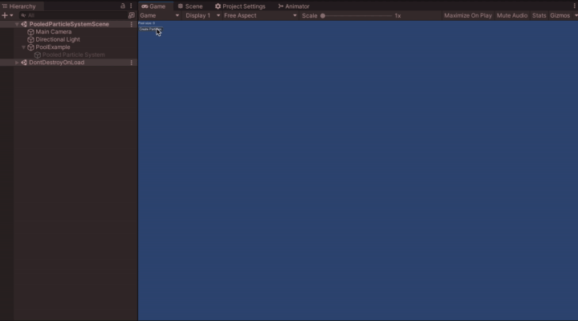

# object-pool-sample

Unity の [ObjectPool](https://docs.unity3d.com/2021.1/Documentation/ScriptReference/Pool.ObjectPool_1.html) を使ったサンプルになります。

## 開発環境

macOS Big Sur 11.2.3

Unity 2021.1.12f1

## PoolExample

マニュアルに記載されている[サンプル](https://docs.unity3d.com/2021.1/Documentation/ScriptReference/Pool.ObjectPool_1.html)に少し手を加えました。

### 解説
- [Unity の ObjectPool を使う](https://heratta-lab.com/object-pool-pool-example/)